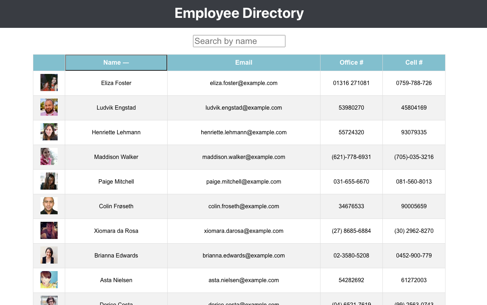

# employee-directory

## Links
Link to deployed application [Heroku Link](https://fast-beyond-42631.herokuapp.com/)

## Summary
Using react to create an employee directory to that an employeer can easily view all their employees at once and have quick access to thier information.  

## Table of Contents
1. [Usage](#usage)
2. [SetUp](#setup)
3. [What I Learned](#what-i-learned)
4. [Resources](#resources)
5. [Getting Started with Create React App](#getting-started-with-create-react-app)

## Usage
Creating an employee direction using React. A table displays the employees non-sensitive data with a picture of the employee, their full name, email, office number, and cell phone number.  A search bar at the top of the page lets a user sort the employees by name and a button on the name column of the employee table lets you sort the employees by name in accending order alphabetically. The user can also sort the employees by name alphabetically if the user is using the search bar as well.  

## Setup
This application was created in react with componets. UseState is used to manage state and useEffect is used to respond to user events. The app is broken up into three componenets: employee, table, and searchbar. The individual components hold props. 

UseEffect is helpful in setting up the sorting and filtering capabilites.  

IndexDB is also used to store or hold data/ transcations inside the users browser while the application is offline. The db.js file used in this application was copied from week 17 mini-project but some tweeks were added to it so that the indexDB and service worker could work together. While offline the user can still enter deopsits or expenses into the app those transactions are then stored in the IndexDB on the users browser. 

## What I Learned
This project was difficult to set up at first. I was trying to figure out how the components would talk together and come together in App.js. I ultimaly decided to use hooks as it was easier to manage and change the state of the components with useState and useEffect. 

Styling in react also came with some challenges. I attempted to add a few inline style componenets, but they did not interact well or just didn't work at all so I switched to creating and exporting css files for each component. 

## Resources
* [CSS Styling in React](https://reactjs.org/docs/faq-styling.html)
* [React Docs](https://reactjs.org/docs/getting-started.html)
* [React Hooks](https://reactjs.org/docs/hooks-intro.html)
* [Random User API](https://randomuser.me/) 

## Getting Started with Create React App

This project was bootstrapped with [Create React App](https://github.com/facebook/create-react-app).

### Available Scripts

In the project directory, you can run:

### `npm start`

Runs the app in the development mode.\
Open [http://localhost:3000](http://localhost:3000) to view it in the browser.

The page will reload if you make edits.\
You will also see any lint errors in the console.

### `npm test`

Launches the test runner in the interactive watch mode.\
See the section about [running tests](https://facebook.github.io/create-react-app/docs/running-tests) for more information.

### `npm run build`

Builds the app for production to the `build` folder.\
It correctly bundles React in production mode and optimizes the build for the best performance.

The build is minified and the filenames include the hashes.\
Your app is ready to be deployed!

See the section about [deployment](https://facebook.github.io/create-react-app/docs/deployment) for more information.

### `npm run eject`

**Note: this is a one-way operation. Once you `eject`, you can’t go back!**

If you aren’t satisfied with the build tool and configuration choices, you can `eject` at any time. This command will remove the single build dependency from your project.

Instead, it will copy all the configuration files and the transitive dependencies (webpack, Babel, ESLint, etc) right into your project so you have full control over them. All of the commands except `eject` will still work, but they will point to the copied scripts so you can tweak them. At this point you’re on your own.

You don’t have to ever use `eject`. The curated feature set is suitable for small and middle deployments, and you shouldn’t feel obligated to use this feature. However we understand that this tool wouldn’t be useful if you couldn’t customize it when you are ready for it.

## Learn More

You can learn more in the [Create React App documentation](https://facebook.github.io/create-react-app/docs/getting-started).

To learn React, check out the [React documentation](https://reactjs.org/).

### Code Splitting

This section has moved here: [https://facebook.github.io/create-react-app/docs/code-splitting](https://facebook.github.io/create-react-app/docs/code-splitting)

### Analyzing the Bundle Size

This section has moved here: [https://facebook.github.io/create-react-app/docs/analyzing-the-bundle-size](https://facebook.github.io/create-react-app/docs/analyzing-the-bundle-size)

### Making a Progressive Web App

This section has moved here: [https://facebook.github.io/create-react-app/docs/making-a-progressive-web-app](https://facebook.github.io/create-react-app/docs/making-a-progressive-web-app)

### Advanced Configuration

This section has moved here: [https://facebook.github.io/create-react-app/docs/advanced-configuration](https://facebook.github.io/create-react-app/docs/advanced-configuration)

### Deployment

This section has moved here: [https://facebook.github.io/create-react-app/docs/deployment](https://facebook.github.io/create-react-app/docs/deployment)

### `npm run build` fails to minify

This section has moved here: [https://facebook.github.io/create-react-app/docs/troubleshooting#npm-run-build-fails-to-minify](https://facebook.github.io/create-react-app/docs/troubleshooting#npm-run-build-fails-to-minify)

# May need later
package.json:  "homepage": "https://github.com/ClairePhillips51/employee-directory#readme"